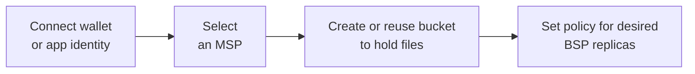
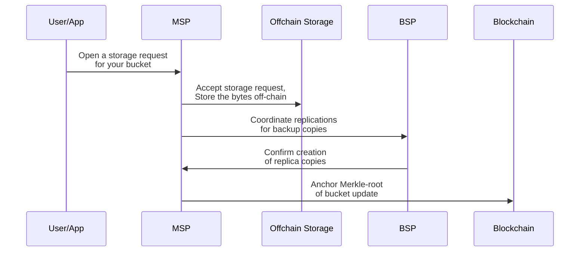
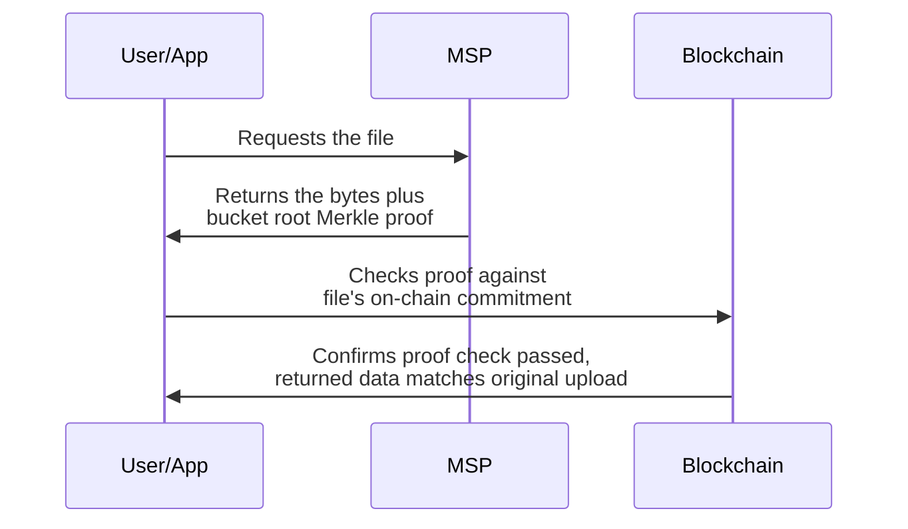
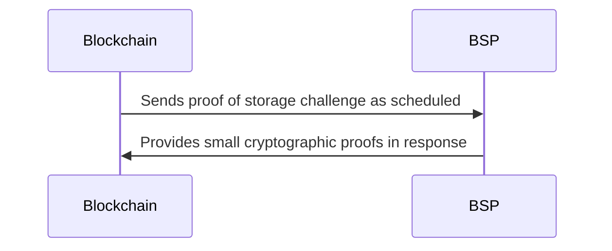
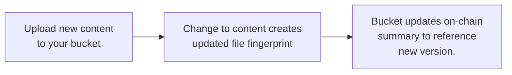
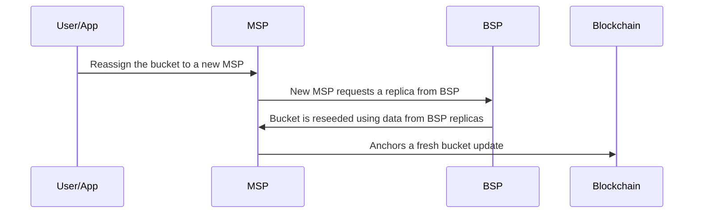

# Data Flow and Lifecycle

DataHaven separates storage from verification: storage providers hold the bytes, and the chain records a compact, verifiable receipt.

This page follows a file’s journey from choosing a Main Storage Provider (MSP) and bucket to uploading, policy-driven redundancy with Backup Storage Providers (BSPs), retrieval with an integrity check, and ongoing health checks. It also shows, at a high level, how updates create new versions and how you can move or remove data. 

## Roles at a Glance

- **User / Application**: Initiates actions such as choosing an MSP, creating buckets, uploading files, and retrieving stored data.
- **DataHaven chain**: Maintains compact on-chain commitments (bucket roots from MSPs, global roots from BSPs) and coordinates BSP challenges.
- **Storage Providers**: DataHaven divides data storage, verification, and retrieval responsibilities across Main Storage Providers (MSP) and Backup Storage Providers (BSP). 

Storage provider roles compare as follows:

| MSP                                                                     | BSP                                                                       |
|-------------------------------------------------------------------------|---------------------------------------------------------------------------|
| Chosen by the user.                                                     | Randomly assigned by the network.                                         |
| Maintains the bucket trie (primary copy).                               | Replicates data across the network (backup copies).                       |
| Periodically anchors the bucket root on-chain.                          | Periodically posts the global Merkle commitment of all files stored.      |
| Serves files for read requests.                                         | Not part of the normal read path.                                         |
| Performance is incentivized by competition to attract and retain users. | Performance ensured via a slashing mechanism for failed proof challenges. |

Now that you understand roles, you are ready to follow the step-by-step journey of data through the DataHaven lifecycle.

## Connect and Choose

The first steps of the dataflow are as follows:

## Upload the File

Once you connect to the network, select your MSP, and have a bucket, the upload steps are as follows:

If replication or anchoring fails, the upload aborts.

## Share Your Bucket

You can share access to your bucket by generating a link that provides view-only or view-and-upload access to its contents, including all files and folders.

## Retrieve the File

The process to retrieve a file you successfully uploaded to DataHaven is as follows:

## Verify Storage Over Time

Scheduled health checks, in the form of proof challenges, ensure BSPs retain your backup copies over time as follows:

If the BSP returns the expected information, the health check passes. BSPs face slashing penalties in the event of data loss resulting in a failed proof challenge.

## Change or Replace a File

The flow for changing or replacing a file is as follows:

It is important to note that whether older versions of files are retained is determined by your app's or storage provider's policy.

## Remove Your Data

You can remove a file's reference from a bucket by deleting its entry.

## Change Your MSP

The process to change your MSP for a bucket is as follows:

BSP to MSP reseeding allows you to easily change MSPs without manually transferring files.

## Next Steps

Now that you understand DataHaven's data storage lifecycle, consider these resources to get hands-on and start building.

-   <a href="/store-and-retrieve-data/use-storagehub-sdk/get-started/" markdown>:material-arrow-right:

    **Get Started with the StorageHub SDK**

    Environment set up and dependency installation to get your project started.

    </a>

-  <a href="/store-and-retrieve-data/use-storagehub-sdk/end-to-end-storage-workflow/" markdown>:material-arrow-right: 
    
    **End-to-End Storage Workflow**

    Step-by-step tutorial covering the entire data storage workflow.

    </a>

