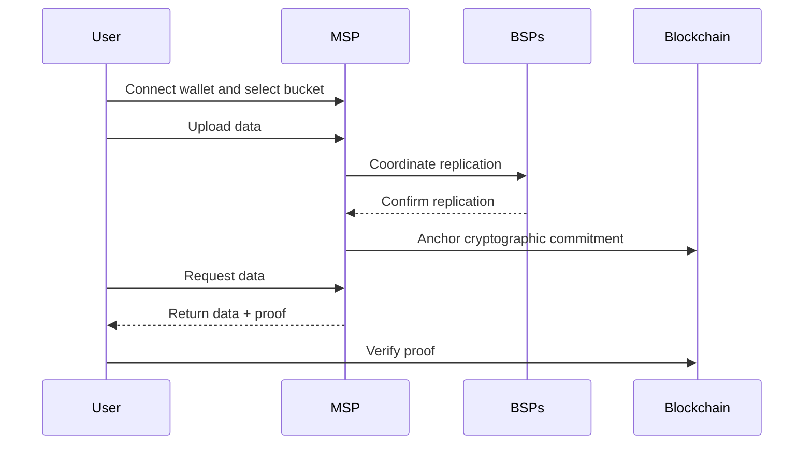

# Store and Retrieve Data Overview

DataHaven is a verifiable storage network that separates storage from verification. Storage providers hold your file bytes off-chain, while the chain records compact on-chain commitments. These commitments serve as "receipts" so data can be checked at read time.

This section provides a high-level overview of how to create a bucket, upload files, and retrieve them.

## How File Storage Works at a Glance

1. **Pick an MSP and bucket**: Connect your wallet, select a Main Storage Provider (MSP), and create a bucket. Set your desired replication factor for backup copies.

2. **Upload data**: Send a storage request to the MSP, which stores your file and coordinates replication to Backup Storage Providers (BSPs). Once enough BSPs confirm storage, the MSP records a cryptographic commitment on-chain, securing your file on the network.

3. **Retrieve data**: The MSP returns your file with a proof that you can verify against the on-chain commitment, confirming your data matches what was stored.

DataHaven provides the benefits of provable data without the high cost of storing entire data files on-chain.

## Store Data with StorageHub SDK

Use the following how-to guides to move through the DataHaven storage and retrieval lifecycle:

[timeline.left(datahaven-docs/.snippets/text/store-and-retrieve-data/overview/timeline-01.json)]

You can also visit the [End-to-End Storage Workflow](/store-and-retrieve-data/use-storagehub-sdk/end-to-end-storage-workflow/) tutorial for a streamlined walk-through using DataHaven's StorageHub SDK to store and retrieve data.

## Next Steps

-  <a href="/store-and-retrieve-data/starter-kit/" markdown>:material-arrow-right: 
    
    **Data Storage Starter Kit**

    Find what you need to connect and build on DataHaven, from network configurations to obtaining testnet tokens.

    </a>

-   <a href="/store-and-retrieve-data/use-storagehub-sdk/get-started/" markdown>:material-arrow-right:

    **Get Started with the StorageHub SDK**

    Set up a project and install the StorageHub SDK to start storing and retrieving data.

    </a>

