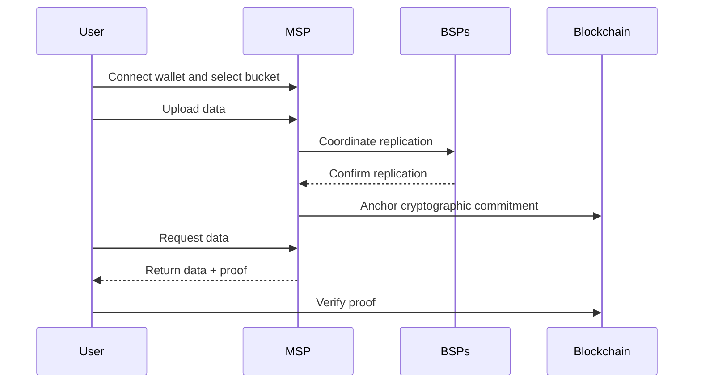

# Store and Retrieve Data Overview

DataHaven is a verifiable storage network that separates storage from verification. Storage providers hold your file bytes off-chain, while the chain records compact on-chain commitments (“receipts”) so integrity can be checked at read time.

This section provides a high-level overview of how to create a bucket, upload files, and retrieve them.

## How File Storage Works at a Glance

1. **Pick an MSP and bucket**: Connect your wallet, select a Main Storage Provider (MSP), and create a bucket. Set your desired replication factor for backup copies.

2. **Upload data**: Send a storage request to the MSP, which stores your file and coordinates replication to Backup Storage Providers (BSPs). Once enough BSPs confirm storage, the MSP records a cryptographic commitment on-chain, securing your file on the network.

3. **Retrieve data**: The MSP returns your file with a proof that you can verify against the on-chain commitment, confirming your data matches what was stored.

## Key Considerations

Before you jump into guides, here are a few considerations:

- **Costs and deposits**: Network fees apply. Storage is billed via a prepaid deposit that streams per block and auto-pauses when the balance falls below a minimum threshold.
- **MSP choice and capacity**: You pick an MSP. Market dynamics encourage MSPs to offer capacity and performance at competitive prices. You can reassign a bucket to a new MSP later; the new MSP rehydrates from BSP replicas (no manual copying required).
- **File status and replicas**: Treat files as “verified” only after a fulfillment signal (e.g., an `StorageRequestFulfilled` event is emitted) and, ideally, show the current replicas vs. the target so users can see progress.
- **Large files**: Files up to 2 GB are currently supported (subject to change). The app automatically handles chunking and integrity checks under the hood.

## Next Steps

-   **Get Everything You Need**

    ---

    Find what you need to connect and build on DataHaven, from network configurations to obtaining testnet tokens.

    [:octicons-arrow-right-24: Get started](/store-and-retrieve-data/quick-start/)

-   **Get Started with the StorageHub TypeScript SDK**

    ---

    Set up a project and install the StorageHub SDK to start storing and retrieving data.

    [:octicons-arrow-right-24: Get started](/store-and-retrieve-data/use-storagehub-sdk/get-started/)

